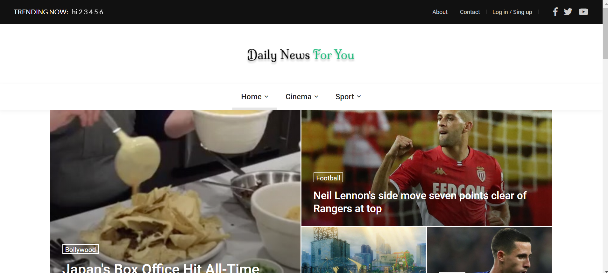
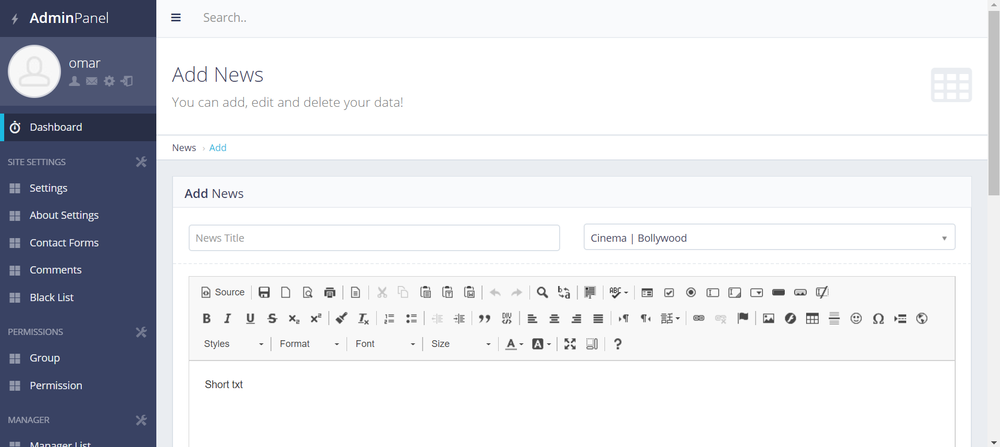

# Daily News For You is an online news portal developed using Django and Python [](http://hits.dwyl.com/IamOmaR22/Django-Online-News-Portal)

**[Live Demo](https://iamomar22.pythonanywhere.com/)**

# Tools
## Front end part
* HTML
* CSS
* BOOTSTARP
* JavaScript
## Backend
* Django
* SQLite 3

## I Used Here My Own Customized Admin Panel.
```
This Website is fully Dynamic.
You can change every part through Admin Panel,
Masteruser can controle everything.
```

# Features:
```
1. An Admin Can Get All The Access Of This News Site.
2. A Normal User Can Add News (Need Admin's Permission To Publish News).
3. Admin Can Add Group Users.
4. Logged In or Without Login, A User Can Comment A News.
5. Need Admin's Permission To Publish Comment.
6. There Are Many Section Contains In This Site.
7. View will be counted.
8. Most viewed news will be shown in first.
9. There is a category and Sub-category.
10. If there is a news for particular cat or subcat then the cat will be shown.
11. In contact section i gave a QR Code. By scanning QR Code you can redirected into My github account.
12. I used forloop to view news in different section.
13. Therer is a trending section. You can see the breaking newses here.
etc...........
```

# Screenshots of the Project:
<p align="center">
  
  
</p>

**Copyright (c)** 2020-3020 Md. Omar Faruk

## Go Through This Site Then You Will Know About This Site Properly.
